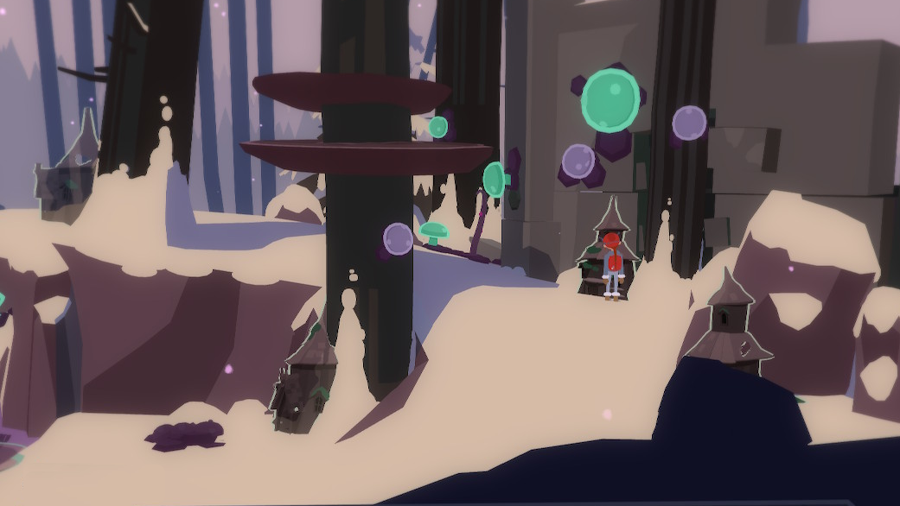

Älva was captured by the toadstool at the north area of the forest. You get there by going up the mushroom steps.
It will give you a key to get its magic wand.

# I have the key
It said it lives under a *tree*...

# Really?
It is one of those tiny houses that are visible with your all-seeing mask. Those are in all the areas around Poisoned Forest.

# Any hints?
There isn't much hints to do. Except it is really under a tree. And, you don't have to use the key to each of them! When you look (without the key) the correct house, Tove will say that she is *sure* that is the right house.

# Thanks, but show me where it is
Go up the hidden mushroom stairs ^[ Use the all-seeing mask to see them. ] from the main area and enter the entryway.

# And?
Head far right end of the area. It is the one under the tree. Use the key into it.

# Got the wand
Return to Älva and free it. ^[ Use the wand on the toadstool. ]
