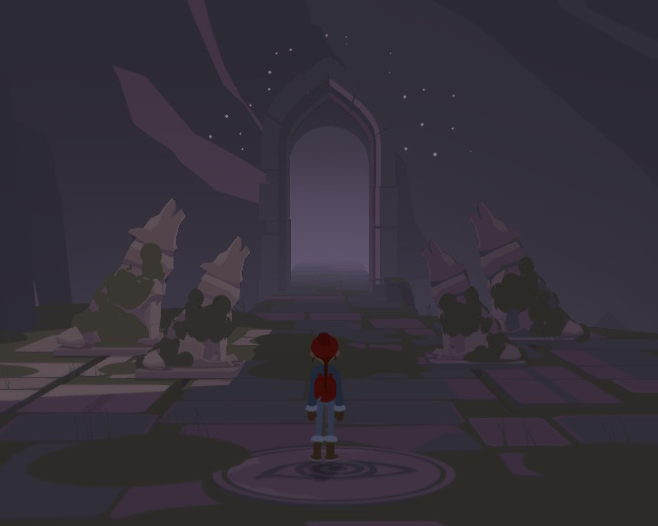

The first puzzle in the Wof Ruins involves four wolf statues.

# What to do?
Notice the four shadowy statues. Also notice the eye symbol on the ground.

# Yes?
The eye symbols is the *vantage point*.

# So?
You have to move the statues so that they match the shadowy statues when you look at them from the vantage point.

# Show me a picture
This is what you try to achieve.

