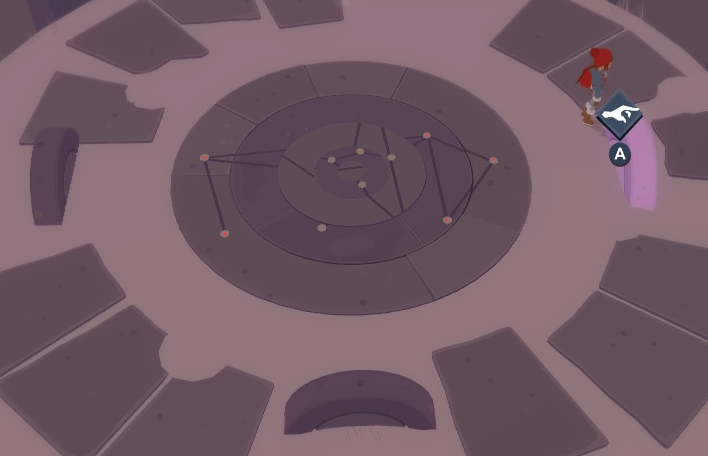

There are four pillars with star constellations marked on them. One of them is broken.
There's also the disc in the center. The rings are moved with the wheels.

# So, what to do?
Use the wheels and move the rings so that they form a constellation.

# Which constellation?
Don't you want to try, first?

# No, tell me the right one
Replicate the constellation that is shown in the second pillar from the right.

# How?
Start from the outer ring. It moves with the right wheel. The outer ring should be in correct position, so that the larger dark ring can match it.

# Okay, it is there
Now, the bottom wheel moves the larger dark ring **and** the smaller dark ring. The left wheel moves the inner light ring **and** the smaller dark ring. So, the smaller dark ring is moved by *both* bottom and left wheel.

# Tricky
It is. You just have to use the left and bottom wheels until they connect. There isn't really any trick but trial and error. It shouldn't take long.
