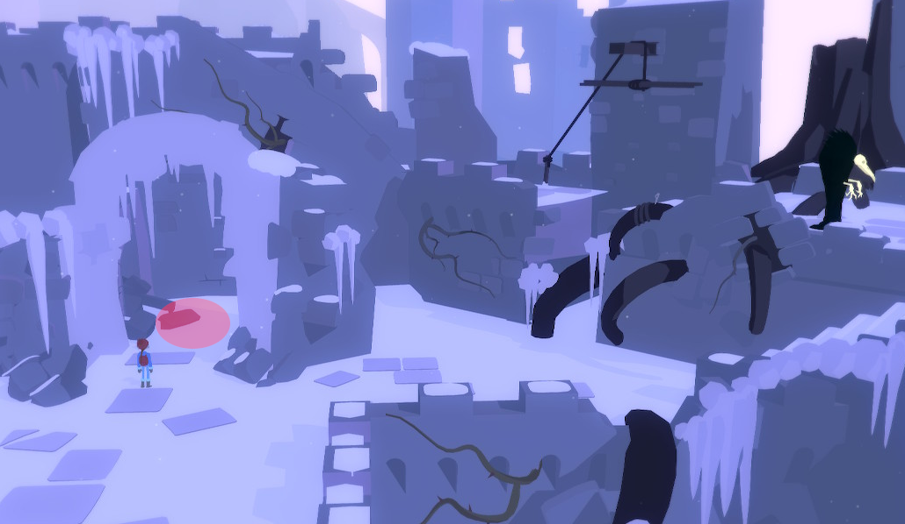

*Tove*'s way up is blocked by that *live* raven creature.

# What to do to it?
The other live ravens are in cages.

# There is an empty cage
Maybe you could lure it in there.

# How?
*Henrik* can open the cage.

# It won't go in
You need some bait to lure it in.

# What bait?
They really like this specific fruit. ^[ There is a fruit behind the icy arch. *Tove* can see it.  ]

# I see the fruit
But *Tove* needs, again, help climbing there. ^[ *Henrik* can pick another piton sticking in the root behind the raven. ]

# I have another piton
Hammer it into the crack. *Tove* can now climb up and grab the fruit.

# I have the fruit, now
Use it as a bait. ^[ *Henrik* will open the cage. *Tove* will put the fruit into the cage. ]
