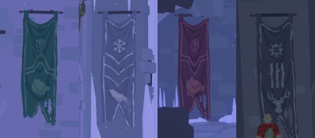

*The four guardian creatures appeared. Each paired in battle with a wayward season. At last, order was restored. A path to the future opened anew.*

For the second riddle you have to find the pairs.

# Find the pairs?
Push the statue season tile while pressing the corresponding slab in front of the table.

# How do I do that?
*Henrik* can stand on the slab while *Tove* pushes the button.

# But what button matches what slab?
Oh, you can find hints [from the banners](10-banners.md).

# Don't get it
Each banner has a season symbol and the animal. Match the animal from the slab to the symbol on the statue.

# Tell me the correct pairings
The pairings are:
 - Spring: Wolf
 - Winter: Raven
 - Autumn: Bear
 - Summer: Stag
