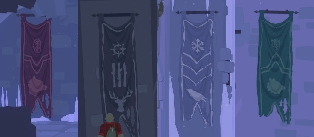

The four banners around the castle can help you solve the riddles in the dining room.

# Where are they
 - Wolf banner ^[ It is at Eastern Ramparts, stairs down and right. ]
 - Raven banner ^[ At the main courtyard. Left from the well. ]
 - Bear banner ^[ In the dungeons. Left from the door. ]
 - Stag banner ^[ In the supply building tunnels. Left from the torch room. ]

# Can you show me them?
Here are all four in one picture:

# What to do with these?
Look at the statues in the dining hall. The banner design matches those statues.

