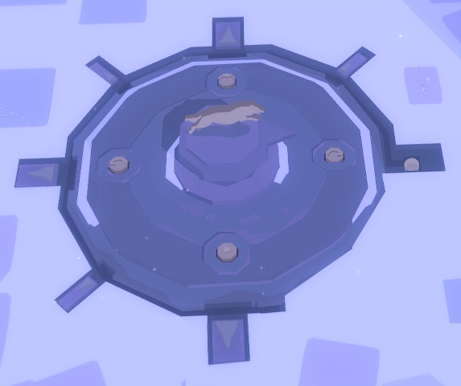

To solve this riddle you have to find [all four keystones](130-four-keystones.md).

# I have the four keystones
Read the hint riddle from the wolf statue.

*The sun rises in the east and sets in the west. The wolf begins its pursuit of the sun at dawn and chases it until dusk. Only at twilight will the wolf retreat to her underground lair.*

# Okay?
That yellow ball, east of the wolf, is the sun...

# So..
*The sun rises in the east and sets in the west.* ^[ Put the sunrise stone to the right, or east, near the "sun". Put the sunset disc left, or west. ]

# Two to go
Look at the path the sun will travel.

# It goes counter-clockwise
Correct. So the north slot is...

# ...the noon!
Put the noon disk at the north slot. And twilight, the star stone, is in the bottom, or south.

# The sun!
Now you can push the sun and it starts its movement through the path.

# It is blocked
Oh yeah, those small markers need to be pulled away. The large markers can be pulled by *Henrik* and the small ones by *Tove*.

# But...
And only one large and only one small marker *at a time* can be pulled.

# How to solve this?
You have to be quick. Pull the first small and large markers open. Then start the sun movement. Now you just have to quickly change between Henrik and Tove and pull the blocking marker open while the sun moves. This is the only *arcade*-style puzzle in the game where your finger agility is in play. Don't worry, it moves slowly enough.
